1.	git clone git@github.com:NG-ZORRO/ng-zorro-antd.git
2.	Checkout branch 13.4.0(target branch)
3.	Replace files(in tree.zip)
4.	Run "npm run build:lib"
5.	Switch ‘publish’ folder
6.	Run “npm pack”

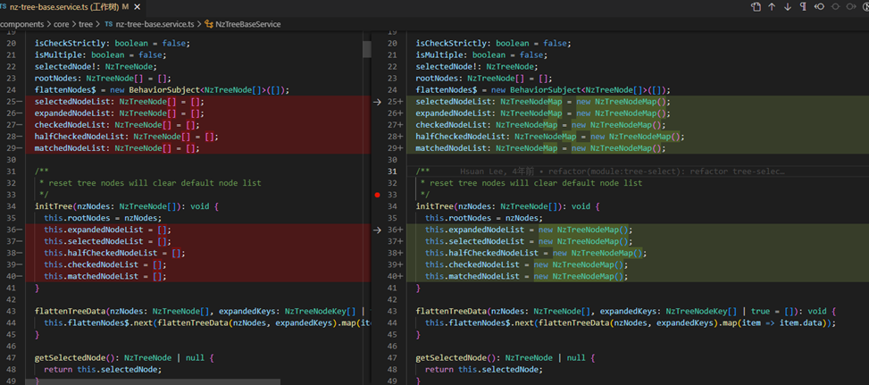
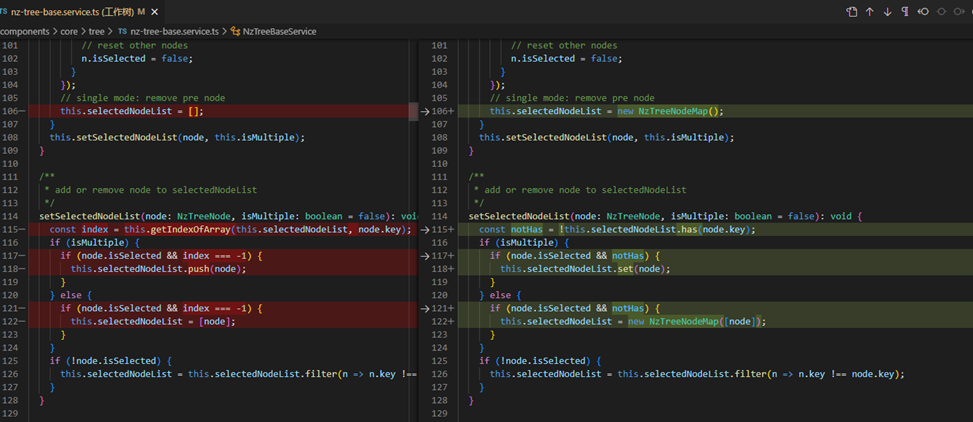
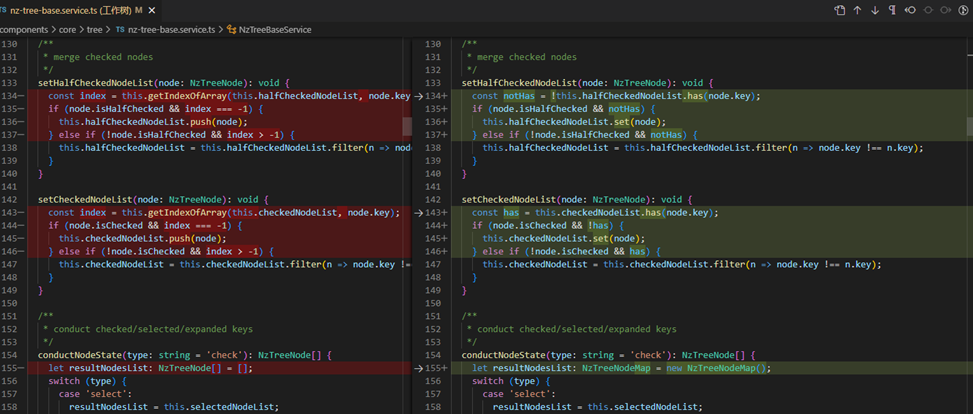
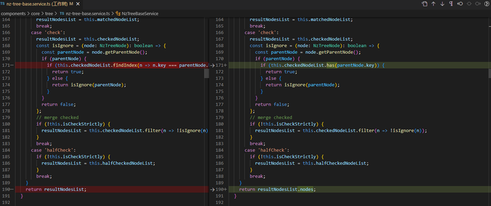
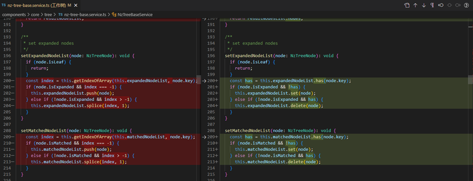
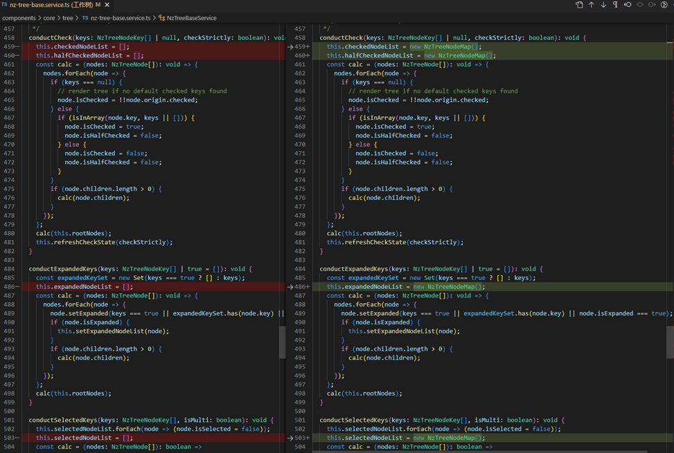
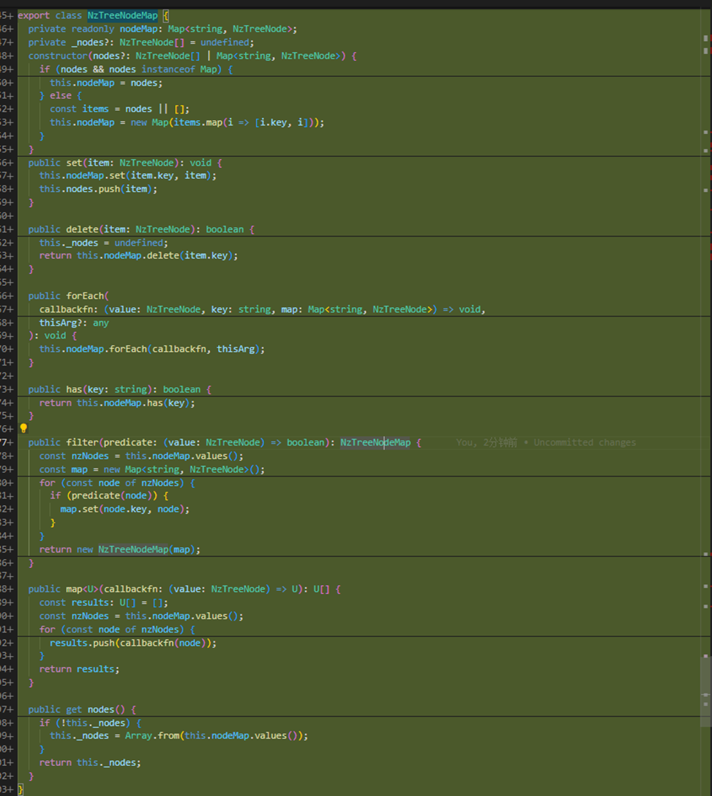
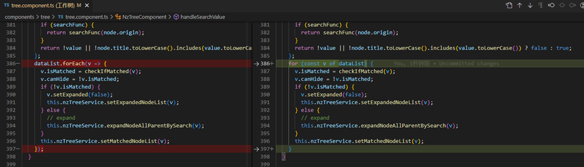
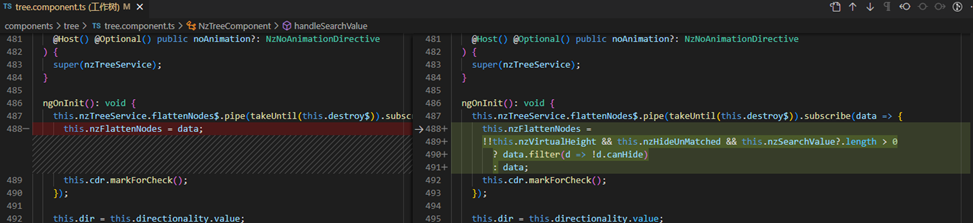
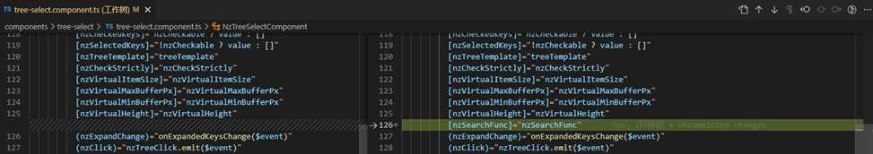
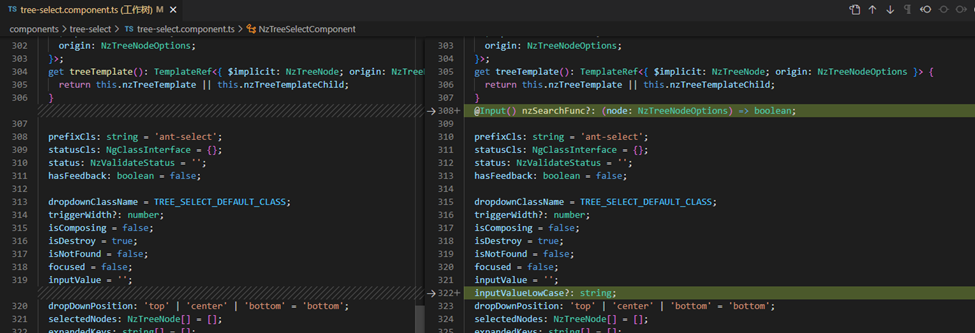
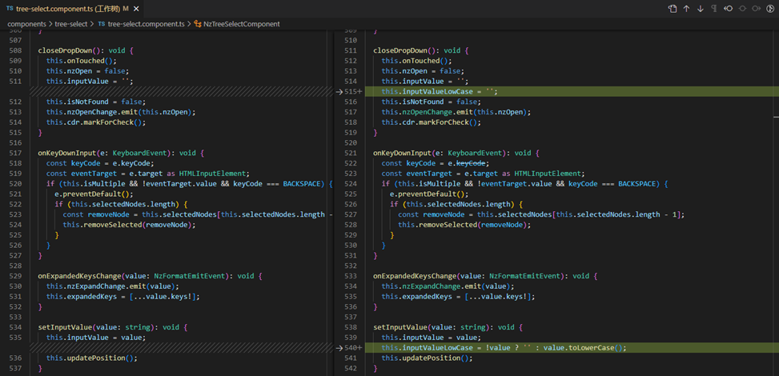
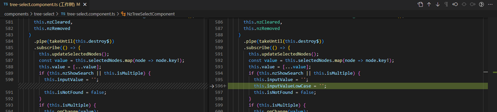